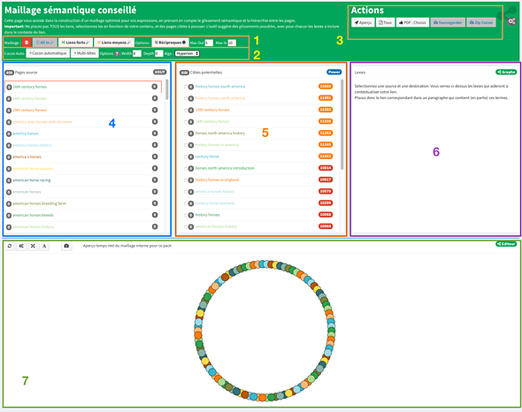
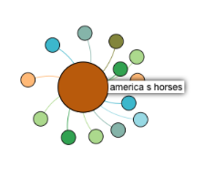

Version du 3 mai 2018

* [Les metamots, préalables](#les-metamots-préalables)
* [Tarifs](#tarifs)
* [Plus de packs](#plus-de-packs)
* [Lancer un calcul de metamots](#lancer-un-calcul-de-metamots)
* [Ciblage Langue-Pays](#ciblage-langue-pays)
* [Calculer des metamots](#calculer-des-metamots)
* [Mes metamots et metamots de démo](#mes-metamots-et-metamots-de-démo)
* [Résumé du calcul](#résumé-du-calcul)
* [Parfum](#parfum)
* [Potentiel](#potentiel)
* [Simulations](#simulations)
* [Optimisations](#optimisations)
* [Vue générale](#vue-générale)
* [Détails des metamots](#détails-des-metamots)
* [Maillage sémantique](#Maillage sémantique)
* [Calculer un maillage interne](#Calculer un maillage interne)
* [All In](#All In)
* [Liens forts](#Liens forts)
* [Liens moyens](#Liens moyens)
* [Maillage manuel](#Maillage manuel)
* [Options de maillage](#Options de maillage)
* [Export des données de maillage](#Export des données de maillage)
* [Calculer un cocon sémantique](#Calculer un cocon sémantique)
* [Calculer plusieurs cocons en une seule fois](#Calculer plusieurs cocons en une seule fois)
* [Visualisation](#Visualisation)
* [Ajouter des metamots à un lot déjà calculé](#Ajouter des metamots à un lot déjà calculé)
* [Donner un accès restreint à l'espace "optimisations" à vos rédacteurs](#Donner un accès restreint à l'espace "optimisations" à vos rédacteurs)
* [Calculer des idées d'intertitres ou de paragraphes](#Calculer des idées d'intertitres ou de paragraphes)
* [Aspirer votre page actuelle dans optimisation](#Aspirer votre page actuelle dans optimisation)

## Les metamots, préalables

1) Cette documentation a pour objectif d’expliquer le fonctionnement du service « metamots en SaaS » sur cocon.se.

L’interface utilisateur considérée ici est celle de la langue française.
Cette interface pourrait avoir évolué au moment de la consultation de la documentation que vous lisez en ce moment. Nous vous invitons à consulter la dernière version de la documentation.

2) Rappels :

** Expression :**
Expression-clé définissant le mieux votre page. Pensez avant tout à l'internaute qui ne vous connait pas.

** Metamot :**
Ensemble de lexies composant l’empreinte la plus adaptée à la requête précédente. Une expression « engendre » son metamot. Par conséquent, 1 expression = 1 metamot.

** Lexie :**
Unité sémantique faisant partie d’un metamot. Un metamot est composé d’une ou plusieurs lexies, le plus souvent une quinzaine. Chaque lexie a un rôle précis dans le metamot et ne doit pas être vue comme possiblement séparée des autres.

3) La page « [Présentation](https://self.cocon.se/index.php?action=mm_about) » vous donne un peu de lecture sur le sujet des metamots ainsi que quelques liens.

## Tarifs

La page tarif se trouve [ici](https://self.cocon.se/index.php?action=mm_tarifs).

### Plus de packs

Les packs ont disparu. Aujourd'hui vous achetez des crédits, crédits que vous pouvez utiliser librement pendant 1 an.
1 metamot = 1 crédit.
Ces crédits sont également utilisables pour faire des recherches de sujets avec Eureka.

## Lancer un calcul de metamots

La page dont nous allons parler maintenant se trouve [ici](https://self.cocon.se/index.php?action=mm_new).

### Ciblage Langue-Pays

Les metamots sont disponibles en de nombreuses langues, y compris le Russe.

Chaque calcul nécessite d’intégrer non seulement la dimension « langue », mais aussi la dimension « pays cible ». En effet, les habitudes linguistiques, ainsi que les intentions, varient d’un pays/région du monde à l’autre, mais aussi les habitudes de consommation et la façon d’en parler.

Lorsque vous commandez un calcul, les metamots seront donc spécifiques au couple {langue, région}.

Il peut être intéressant d’ailleurs de comparer le même groupe d’expressions entre plusieurs pays partageant la même langue. Vous pouvez, par exemple, voir comment vos produits et marques rayonnent hors de vos frontières.

### Calculer des metamots

Donnez un nom à votre lot de calcul, nom « parlant » de préférence.

En effet, ce nom vous permettra de retrouver ces calculs plus tard. Il est donc indispensable de penser au futur où vous n’aurez peut-être pas en mémoire ce que vous aviez demandé… Éviter donc d’appeler votre calcul « toto » ou « essai 01 »…

Choisissez votre langue cible et aussi la région du monde que vous ciblez.
Il existe beaucoup de combinaisons possibles, faites attention de ne pas vous tromper.

Entrez une expression par ligne. Vous pouvez aussi y placer des couples {expression-clé, URL}. Pour ce faire, chaque ligne doit être saisie ainsi :
expression TABULATION URL absolue de la page

Les étapes suivantes sont si évidentes que l’on ne vous fera pas l’injure de vous les expliquer…

Note : une fois votre demande validée, les calculs se font en tâche de fond. Vous pouvez donc quitter votre navigateur et revenir plus tard.

## Mes metamots et metamots de démo

rendez-vous [ici](https://self.cocon.se/index.php?action=mm_list).

Cette page est une entrée qui en comprend plusieurs autres.

Note : certains des lots ici sont des démos et ne sont pas modifiables.

* Le numéro du job est un identifiant unique et sert de numéro de référence.
* L’état précise si le calcul est toujours en cours ou si celui-ci est terminé. (Les metamots ne sont bien sûr disponibles que si leurs calculs sont terminés.)
* Le titre est celui que vous avez précisé lors de votre demande de calcul. Il n’est pas modifiable.
* La date de commande est la date à laquelle vous avez demandé le calcul.
* Les autres informations sont évidentes.

Note : L’action de suppression d’un calcul est définitive, réfléchissez bien avant de procéder à celle-ci.

Pour consulter un calcul, cliquez sur son titre. Vous arriverez alors sur un résumé vous donnant accès aux diverses informations disponibles.

###Résumé du calcul

Cliquez dans le lot que vous voulez analyser dans la liste.

La page d’entrée vous donne déjà quelques informations sur le résultat :

### Parfum

Chaque expression a son environnement dans les résultats de recherche.

À partir de la vue « Résumé », vous pouvez cliquer sur la vue « Parfum » pour voir le détail de cette dernière.

Vous pouvez aussi aller à cette vue en cliquant sur « Parfum » dans le menu de gauche.

Le « Parfum » vous permet d’appréhender l’environnement concurrentiel sur chaque expression.

Un environnement très documentaire, par exemple, donne à réfléchir sur la stratégie de contenu à avoir pour la page devant répondre sur l’expression. De même, si des photos sont présentes, une bonne idée serait de songer à en proposer aussi.

Le parfum doit donc vous inspirer pour être à armes au minimum égales avec votre concurrence, expression par expression.

Si vous avez des images dans les résultats de recherche, pourquoi ne pas tenter d’y mettre une des vôtres ?

### Potentiel

À partir de la vue « Résumé », vous pouvez accéder à cette vue « Potentiel » pour voir le détail de celle-ci.

Vous pouvez aussi aller à cette vue en cliquant sur « Potentiel » dans le menu de gauche

Le potentiel mesure le « charme » maximum d’un metamot. Chaque metamot a en effet un pouvoir plus ou moins important en lui-même. Il s’agit vraiment du potentiel de « charme » intrinsèque du metamot, pas celui du metamot par rapport à votre concurrence.

Dans le cas d’un déploiement progressif des metamots sur votre site, vous pouvez vous aider des potentiels pour choisir les contenus à améliorer en premier.

Sur l’histogramme, vous avez une vue rapide sur le potentiel de chaque metamot de votre pack.
En passant la souris sur les barres verticales, vous pouvez savoir quel metamot se cache derrière chacune des barres de l’histogramme.

Puis vous avez tous les metamots sous forme de liste avec deux indications :

* le potentiel proprement dit,
* le nombre (constaté) de mots de votre environnement concurrentiel éligible par son contenu.

### Simulations

À partir de la vue « Résumé », vous accédez à cette vue « Simulations » pour en voir le détail.

Vous pouvez aussi aller à cette vue en cliquant sur « Simulations » dans le menu de gauche.

Les simulations vous aident à doser facilement l’usage des lexies dans les contenus de vos pages.

Dans la colonne de gauche, sélectionnez simplement un des metamots, choisissez la taille du texte pressenti. La liste des lexies apparaîtra dans la colonne de droite avec le dosage préconisé.

Vous pouvez aussi exporter tous les metamots en PDF en une seule opération : cliquez pour cela sur le bouton en haut à droite « PDF 1000 » (1000 étant la quantité choisie dans cet exemple).

### Optimisations

Cette page de résultats de calculs vous donne différentes informations sur l'état de l'optimisation des pages qui vous sont concurrentes et, si vous avez renseigné vos urls, votre niveau actuel d'optimisation.

Analyse des titres des pages de votre thématique

Ce qui est analysé :
Seul le contenu textuel visible à l’internaute est considéré.
Sont ignorés les balises « alt » et autres éléments cachés aux yeux de l’internaute.
Quand c’est possible, nous essayons de supprimer également les menus, footer, etc.

À partir de la vue « Résumé », vous pouvez accédez à cette vue « Optimisations » pour en voir le détail.

Vous pouvez aussi aller à cette vue en cliquant sur « Optimisations » dans le menu de gauche.

Cette vue vous permet de mesurer vos pages actuelles par rapport à votre concurrence.

L’optimisation du Title est toutefois donnée à titre indicatif puisqu’en 60 caractères, il est très difficile d’être à 100 %.

Vous pouvez toutefois améliorer très sensiblement votre contenu.

Note : Si vous répétez trop de fois les lexies, votre score descendra. Il faut donc viser juste.

Vous pouvez exporter au format PDF l’ensemble des couples {metamots, URL} en cliquant sur le bouton PDF.

En cliquant sur « optimisation en direct », vous accédez à cet écran :

Vous pouvez, alors, choisir la page que vous voulez optimiser en cliquant dans le lien correspondant dans la liste.

Si vous avez déjà travaillé un des textes, le pourcentage de son optimisation apparaît dans les colonnes de droite. Vous pouvez donc vous comparer au top10.

En cliquant sur une des lignes ou sur l’icone « écriture », vous avez accès à l’écran suivant :

Dans la zone du haut, vous pouvez améliorer votre balise « TITLE ». Ne perdez pas de vue que vous ne pourrez sans doute pas l’optimiser à 100 % car vous ne disposez que de 65 caractères si vous voulez être efficace dans les moteurs de recherche.

Le calcul sera mis à jour avec le bouton « Sauver et calculer » en haut à droite de cette zone.

De même, vous pouvez optimiser votre texte sans que celui-ci ait besoin de se trouver sur votre site…

Note : Dans cette copie d’écran, le texte a été volontairement masqué.

À droite du champ de saisie, vous disposez des informations vous permettant de réaliser l’optimisation metamot de votre texte. Pour mettre à jour le calcul, appuyez sur le bouton « Sauver et calculer ».

Pour compléter, nous vous donnons une liste de cooccurrences qui, même si elles ont peu d'activités en SEO, permettent d'avoir des idées de contenu.

Vous disposez aussi des "À éviter". Il faut comprendre cette alerte avec un peu de subtilité : il peut s'agir de lexies appartenant effectivement à votre thématique mais qui ferait glisser le metamot vers une autre expression que celle que vous avez fournie… donc, éviter de perdre aussi bêtement votre travail ;-)

Note : Une bonne rédaction sur le web nécessite des phrases de moins de 15 mots. Pensez-y ! C’est aussi une façon de juger un bon rédacteur ;-)

### Vue générale

À partir de la vue « Résumé », vous pouvez accéder à la « Vue générale » en cliquant sur détail (!).

Outre une visu globale et une liste interactives, vous pouvez visualiser le voyage des lexies dans l’ensemble des metamots.

Vous avez aussi accès à la liste de toutes les lexies qui se trouvent dans l’ensemble de votre lot. Cette liste est notamment utile pour concevoir des cocons sémantiques.

### Détails des metamots

À partir de la vue « Résumé », vous pouvez accéder à cette vue en choisissant le metamot que vous voulez analyser pour en voir le détail.

Chaque metamot est spécifique. Il est composé d’un ensemble de lexies qui sont attirées de façon différente **vers l’expression**.

Il existe 3 types de lexies dans un metamot :

1. les omniprésentes : elles sont indispensables, mais non suffisantes,
2. les déterminantes : moins courantes et pouvant être dans une même page, elles caractérisent la qualité de votre page une fois optimisée pour les metamots,
3. les autres : moins importantes, elles ajouteront un zeste de qualité à vos pages.

Toutefois, vous devez placer les 12 premières lexies du metamot sans en omettre aucune, et ce, indépendamment du rôle de chaque lexie dans le metamot, rôle qui ne vous est communiqué que pour information.

Vous pouvez télécharger les données grâce à l’icône avec le nuage.

### Maillage sémantique

Vous pouvez aller à cette vue en cliquant sur « Maillage sémantique » dans le menu de gauche.

Les metamots permettent non seulement de calibrer une page par rapport à son expression-clé, mais permettent surtout d’assurer un glissement sémantique à la fois logique pour l’internaute et à la fois pour les moteurs de recherche.

Pour mieux expliquer cette vue et comment vous en servir, nous allons la découper en 7 zones :

Zone 1 : réaliser un maillage

zone 2 : réaliser un ou plusieurs cocons sémantiques

zone 3 : permet l’export des résultats actuels sous divers formats

zone 4 : elle permet de choisir :
soit les pages sources de liens dans le cas d’un maillage sémantique
soit les pages cibles de cocons sémantiques

zone 5 : utilisée uniquement pour le maillage, cette zone permet de choisir les pages visées par les pages de la zone 4

zone 6 : zone d’informations sur les lexies communes entre la page actuellement sélectionnée en zone 4 et celle actuellement sélectionnée en zone 5

zone 7 : zone de visualisation du maillage ou des cocons sémantiques

Vous devez donc choisir entre : « réaliser un maillage interne » OU « faire un ou plusieurs cocons ».

Pour calculer un maillage, la zone 2 ne sera pas utilisée.
Pour calculer des cocons, les zones 1 et 5 ne seront pas utilisées.

Nous allons dérouler chacune des 3 procédures suivantes :

* Calculer un maillage interne.
* Calculer un cocon sémantique.
* Calculer plusieurs cocons (cocon multitête).

**Les metamots non utilisables pour du maillage ou cocons ne sont pas listés.**

#### Calculer un maillage interne

Il y a trois façons de faire : soit tout faire manuellement (!), soit utiliser les outils automatiques.

##### All In

Choisissez un des metamots sources en zone 4.

Cliquez alors sur « All in ».

Cette action vous permet de faire recevoir à la page « source » sélectionnée tous les liens entrants possibles. Seuls les metamots compatibles sont utilisés.

*Résultat après spatialisation*

Vous pouvez répéter cette opération sur plusieurs metamots de la zone 4 :

*Résultat après spatialisation*

##### Liens forts

Cette opération ne nécessite pas de sélection dans la zone 4, car elle agit sur l’ensemble des metamots. Donc, en 1 clic, vous réalisez tous les liens forts possibles s'il y en a.

Cliquez sur « Liens forts », les pages en très forte affinité se retrouvent liées ensemble, les autres pages sont isolées.

*Résultat après spatialisation*

##### Liens moyens

En cliquant sur « Liens moyens », tous les liens de force moyenne entre les pages compatibles sont calculés. Cette étape peut être faite à tous moments, même après avoir ajouté tous les liens forts.

Cliquez sur « Liens moyens ».

*Résultat après spatialisation*

##### Maillage manuel

Cliquez sur un des metamots de la zone 4.

La zone 5 se met à jour et vous présente les metamots vers lesquels vous pouvez faire un lien à partir du metamot sélectionné dans la colonne de gauche.
Les metamots non affines ne sont pas affichés.
La force de liaison est indiquée dans la colonne « power ».
Cliquez sur la coche des metamots de la zone 5 choisis.

Les puces grises sont mises à jour avec le nombre de liens entrants et sortants de chaque metamot.

Un metamot étant sélectionné en zone 4 et un autre en zone 5, la zone 6 se met à jour avec les lexies qui peuvent être utiliser pour contextualiser le lien qui les relie (lexies à utiliser dans les +/-15 mots de distance du lien; 3 lexies suffisent la plupart du temps) 

##### Options de maillage 

« Réciproques », en manuel, permet de créer le lien retour chaque fois que vous créez un lien.
Cette option ne modifie pas les liens déjà créés.

« Max Out » et « Max In » : vous pouvez limiter ici le nombre de liens entrants et sortants des metamots. Particulièrement utiles en maillage automatique.

##### Export des données de maillage 

« Sauvegarder » votre travail, puis cliquez sur « PDF choisis », toutes les données nécessaires au maillage sont rassemblées dans un PDF. Vous disposez notamment des lexies permettant de glisser entre les metamots, donc, entre vos pages.

#### Calculer un cocon sémantique

Créer un cocon sémantique est très simple. Choisissez le metamot cible dans la liste de la zone 4 puis cliquez sur « cocon automatique ».

L'arborescence de votre cocon est prête :

*Résultat après spatialisation*

Un survol au dessus d’une bulle montre l’expression du metamot en surimpression.

Les bulles de la visu sont également cliquables et permettent de sélectionner le metamot dans la liste de la zone 4.

Vous pouvez récupérer le PDF avec les metamots élus par le logiciel (après avoir « sauvegarder », bien entendu).

Dans le cas des cocons vous avez aussi accès à "Zip cocon", ".xmind" et ".mm"
Avec zip cocon :
Vous récupèrerez un zip de votre cocon sous forme d’un ensemble de pages HTML, une page HTML par metamot **avec les liens du maillage déjà implémentés** [sous forme de liens relatifs]. Il vous restera toutefois à y mettre votre texte…
Les boutons .xmind et /.mm exportent les mindmap.

**Ces 3 boutons ne fonctionnent que pour les cocons, pas pour le maillage classique.**

##### Calculer plusieurs cocons en une seule fois

En premier lieu, cliquez sur « Multi-tête ».

La zone 4 se met à jour en faisant apparaître des coches devant chaque metamot.

Choisissez les metamots que vous voulez cibler en les cochant.

Puis descendez la liste jusqu’en bas et cliquez sur « Calculer le cocon ».

Les cocons sont calculés :

*Résultat après spatialisation*

Les options des cocons sémantiques « classiques » et « multitête » :

« Width » est une demande faite à l’algorithme de préférer un nombre plus ou moins important de pages-sœurs. « Depth » joue le même rôle pour le nombre de niveaux… de profondeur.

Quatre algorithmes différents sont proposés. Chacun d’entre eux produira des résultats souvent différents.

* Hyperion va favoriser le glissement entre pages parents et enfants
* Japet va favoriser le glissement entre pages soeurs
* Themis est le généreux de la bande, il est open et tant que c'est liable, ça lui va.
* Zeus va lui être l'exigent : le glissement Parents/enfants est tout aussi important que les glissements entre pages soeurs.

#### Visualisation

Après le calcul de cocon sémantique, ou après le calcul d’un maillage, les metamots sont disposés ainsi dans la zone 7.

Des outils, en haut à gauche de la zone 7, vous permettent d’agencer les résultats de façon différente.

De gauche à droite :

* réinitialiser l’échelle pour pouvoir tout visualiser,
* spatialisation,
* empêcher le recouvrement,
* montrer les expressions des metamots.

Pour obtenir les vues des exemples précédents, cliquez sur l’engrenage [spatialisation], puis cliquez une deuxième fois dessus dès que la disposition vous convient. Enfin, cliquez sur le « non-recouvrement ».

**NOTE : N'oubliez pas que vous avez la possibilité de récupérer le HTML des cocons…

**

## Ajouter des metamots à un lot déjà calculé

Il est possible de fusionner, sous certaines conditions, de fusionner deux lots de metamots.

Cela peut être utile si on veut ajouter un ou plusiuers metamots à un lot précédant.

Les conditions pour que cela soit réalisable sont les suivantes :
* les deux lots doivent avoir moins de 2 mois
* Les deux lots doivent avoir les mêmes ciblages langue-pays.

Pour réaliser une fusion, rendez-vous sur la page de résumé d'un des deux lots. Tout en bas, vous trouverez un bouton orange "Intégrer pack à…".
Laissez-vous guider, un assistant vous guidera pas à pas.

## Donner un accès restreint à l'espace "optimisations" à vos rédacteurs

Donner accès à un ou plusieurs rédacteurs aux optimisation d'un lot de metamots, choisissez dans la liste de vos lots de metamots le lot pour lequel vous voulez donner un accès.

Dans le menu vertical à gauche, cliquer sur le bouton colorié en orange "Accès rédacteur". Donnez ici le nom d'utilisateur qu'utilise votre rédacteur sur cocon.se (même un compte gratuit). Attention, respectez majuscule et minuscule du nom d'utilisateur.

Votre rédacteur aura alors accès à la partie "optimisation" de ce lot et de ce lot uniquement.

## Calculer des idées d'intertitres ou de paragraphes

Vous pouvez obtenir des idées de paragraphes pour chacun de vos metamots.

Rendez-vous dans la page "optimisation" accessible par le menu vertical de gauche. En fin de page, un bouton orange "Trouver des idées d'intertitres pour ce lot". Cliquez dessus et soyez patient, ce calcul s'opèrera en tache de fond et peut prendre plusieurs heures.

Si des idées ont été trouvées dans un ou plusieurs metamots du lot, vous les retrouverez avec les cooccurrences et lexies dans  la page "optimisation" du metamot pour laquelle cette recherche a abouti.

## Aspirer votre page actuelle dans optimisation

Tout en bas de chaque page, une zone vous permet d'aspirer la page dont vous aurez indiqué l'url.

Le système essayera d'extraire la partie contenu de la page (donc, sans les menus, footer, etc.) Malheureusement, ce n'est pas toujours possible, tous les pages web ne se valent pas. Dans ce cas vous aurez éventuellement à nettoyer les éléments inutiles pour l'optimisation.

## Zone pour ajouter des urls a posteriori

Pour renseigner en une seule fois toutes les urls de tous les metamots d'un même lot, rendez-vous dans la page d'entrée de l' "Optimisation". Sous la liste des metamots, vous trouverez un champ permettant d'entrer les couples {metamots, url} avec la syntaxe suivante :
* un couple par ligne
* couple = metamot + TABULATION + url

[Les metamots en SaaS c’est ici !](https://self.cocon.se/)

